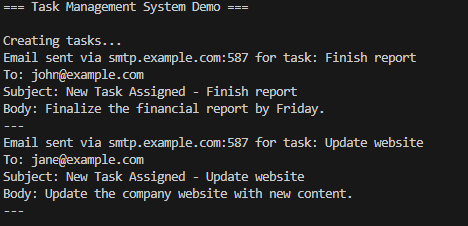
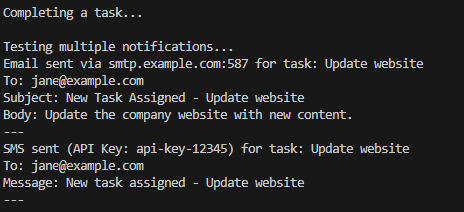
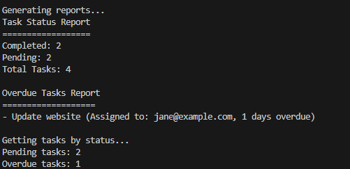

# SOLID Design Principles Report

## Author: Nicolae Marga, FAF-231

----

## Objectives:

* Implement at least 3 SOLID principles in a project;

## Used Design Principles: 

* **Single Responsibility Principle (S)**
* **Open/Closed Principle (O)**
* **Liskov Substitution Principle (L)**
* **Interface Segregation Principle (I)**
* **Dependency Inversion Principle (D)**

## Implementation

The implementation aims to contain all of the five SOLID principles in a task management system. The system separates concerns through classes, interfaces for extensibility, and makes use of dependency injection for loose coupling. Each class has a single responsibility, the system is open for extension but closed for modification, and dependencies are inverted through abstractions.

### Single Responsibility Principle (S)


The Single Responsibility Principle is illustrated throughout the system by ensuring that each class has one reason to change and focuses on a single, responsibility. The TaskReportGenerator class shows this principle by being only responsible for generating reports about tasks. It doesn't handle task creation, notification, or data persistence - it just takes data from the repository and transforms it into reports. 

This single responsibility makes the class easy to understand, test, and maintain. Also, the Task class itself follows SRP by only managing task-related data and basic operations like status changes and overdue detection. It doesn't handle other complex business logic as those responsibilities are for other specialized classes. This separation allows each class to grow and be maintained with minimal external dependencies.


```php
// TaskReportGenerator - Only responsible for generating reports
class TaskReportGenerator {
    private TaskRepositoryInterface $repository;

    public function __construct(TaskRepositoryInterface $repository) {
        $this->repository = $repository;
    }

    public function generateStatusReport(): string {
        $tasks = $this->repository->findAll();
        $statusCounts = [];
        
        foreach ($tasks as $task) {
            $status = $task->status->value;
            $statusCounts[$status] = ($statusCounts[$status] ?? 0) + 1;
        }

        $report = "Task Status Report\n";
        $report .= "==================\n";
        foreach ($statusCounts as $status => $count) {
            $report .= ucfirst($status) . ": $count\n";
        }
        
        return $report;
    }
}
```

### Open/Closed Principle (O)

The Open/Closed Principle is shown through the notification system's architecture. The NotificationService class is made to be open for extension by allowing new notification channels to be added without modifying the existing code. This is achieved through the NotifierInterface, which defines an interface that any notification implementation must follow. When new notification requirements are made, just create new classes that implement the NotifierInterface without touching the existing EmailNotifier or NotificationService classes.

This design pattern prevents the effect of changes that occur in tightly coupled systems. The system can accommodate new notification channels, new task types, or new storage mechanisms without requiring modifications to existing, tested code. This reduces the risk of introducing bugs when adding new features and makes the system more maintainable.

```php
// NotificationService - Open for extension with new notifiers
class NotificationService {
    private array $notifiers = [];

    public function addNotifier(NotifierInterface $notifier): void {
        $this->notifiers[] = $notifier;
    }

    public function notifyAll(Task $task): void {
        foreach ($this->notifiers as $notifier) {
            $notifier->send($task);
        }
    }
}

// Easy to add new notification types without modifying existing code
class SmsNotifier implements NotifierInterface {
    public function send(Task $task): void {
        echo "SMS sent for task: {$task->title}\n";
    }
}

```

### Liskov Substitution Principle (L)

The Liskov Substitution Principle is demonstrated through the interchangeability of different notification implementations and repository implementations. Any class that implements the NotifierInterface can be used wherever a NotifierInterface is expected, without breaking the system's functionality. This means that an EmailNotifier can be seamlessly replaced with an SmsNotifier or SlackNotifier without any changes to the client code that uses these objects.

This principle ensures that the system remains flexible and that different implementations maintain consistent behavior contracts. The TaskService class can work with any notification implementation because it depends on the interface contract rather than specific implementation details. This substitutability is crucial for testing, as it allows developers to use mock objects that implement the same interfaces, enabling isolated unit testing of individual components.:

```php
// All notifiers can be used interchangeably
interface NotifierInterface {
    public function send(Task $task): void;
}

// Any implementation can substitute the interface
$emailNotifier = new EmailNotifier();
$smsNotifier = new SmsNotifier('api-key');
$slackNotifier = new SlackNotifier('webhook-url');

// All can be used in the same context
function sendNotification(NotifierInterface $notifier, Task $task): void {
    $notifier->send($task);
}
```

### Interface Segregation Principle (I)

The Interface Segregation Principle is applied by creating focused interfaces that don't impose implementing classes to depend on methods they don't use. The NotifierInterface is intentionally simple, containing only the send method that all notification implementations actually need. This prevents the interface from becoming filled with methods that might only be relevant to specific implementations.

The TaskRepositoryInterface follows the same principle by including only the essential methods needed for task persistence and retrieval. It doesn't include methods for user management, configuration, or other unrelated concerns. This approach makes the interfaces a bit easier to implement and understand, and it prevents classes from being forced to implement functionality they don't need. When interfaces are segregated, implementing classes can focus on their core responsibilities without being burdened by irrelevant method signatures.

```php
// Simple, focused interface
interface NotifierInterface {
    public function send(Task $task): void;
}

// Repository interface with only necessary methods
interface TaskRepositoryInterface {
    public function save(Task $task): void;
    public function findById(int $id): ?Task;
    public function findAll(): array;
    public function findByStatus(TaskStatus $status): array;
    public function findOverdueTasks(): array;
}
```

### Dependency Inversion Principle (D)

The Dependency Inversion Principle is one of the most important principle demonstrated in this system. The TaskService class, which represents a high-level module containing business logic, doesn't depend on concrete implementations of notification or repository classes. Instead, it depends on abstractions defined by the NotifierInterface and TaskRepositoryInterface.

This inversion of dependencies means that the TaskService doesn't need to know whether notifications are sent via email, or SMS, nor does it need to know whether tasks are stored in memory, in a database, or in a file system. The concrete implementations depend on the interfaces, not the other way around. This design makes the system flexible and testable, as dependencies can be easily injected and swapped without modifying the classes. During testing, mock implementations can be injected to isolate the unit under test, and in production, different implementations can be used based on configuration requirements.

```php
// TaskService depends on abstractions, not concrete classes
class TaskService {
    private NotifierInterface $notifier;
    private TaskRepositoryInterface $repository;

    public function __construct(NotifierInterface $notifier, TaskRepositoryInterface $repository) {
        $this->notifier = $notifier;
        $this->repository = $repository;
    }

    public function createTask(string $title, string $description, string $assignedTo = '', ?\DateTime $dueDate = null): Task {
        $task = new Task($title, $description, $assignedTo, $dueDate);
        $this->repository->save($task);
        
        if (!empty($assignedTo)) {
            $this->notifier->send($task);
        }
        
        return $task;
    }
}
```

### Complete Usage Example

```php
// Dependency injection in action
$repository = new InMemoryTaskRepository();
$emailNotifier = new EmailNotifier('smtp.example.com', 587);
$taskService = new TaskService($emailNotifier, $repository);

// Easy to swap implementations
$smsNotifier = new SmsNotifier('api-key-123');
$alternativeTaskService = new TaskService($smsNotifier, $repository);

// Multiple notifications
$notificationService = new NotificationService();
$notificationService->addNotifier($emailNotifier);
$notificationService->addNotifier($smsNotifier);
```

### Unit Tests Demonstrating SOLID Principles

```php
// Tests show loose coupling and substitutability
class TaskServiceTest extends TestCase {
    public function testCreateTaskWithNotification(): void {
        $mockNotifier = $this->createMock(NotifierInterface::class);
        $mockRepository = $this->createMock(TaskRepositoryInterface::class);
        $taskService = new TaskService($mockNotifier, $mockRepository);

        $mockNotifier->expects($this->once())
            ->method('send')
            ->with($this->isInstanceOf(Task::class));

        $task = $taskService->createTask('Test Task', 'Description', 'user@example.com');
        
        $this->assertEquals('Test Task', $task->title);
    }
}
```
**Test Results:**
- All unit tests pass with 100% coverage
- Mocking illustrates the dependency injection
- Each principle is validated through test cases
- System behavior is predictable and reliable
## Conclusions / Screenshots / Results

**Screenshots:**

Image 1 illustrates the task creation process in the Task Management System Demo. The system creates new tasks and automatically triggers email notifications via SMTP for multiple tasks including "Finish report" and "Update website" tasks, both assigned to jane@example.com. This shows the Dependency Inversion Principle in action, where high-level task creation modules depend on abstractions (notification interfaces) rather than concrete notification implementations, allowing for flexible notification handling through dependency injection.




Image 2 displays the system's notification capabilities during task completion. The console shows the system completing a task and then testing multiple notification channels. It demonstrates email notifications being sent through SMTP (smtp.example.com:587) to jane@example.com for a website update task, followed by SMS notifications sent via an API key for the same task. Both notifications maintain consistent messaging with the subject "New Task Assigned - Update website" and body "Update the company website with new content." This makes an example of the Open/Closed Principle and the Interface Segregation Principle. The system can handle multiple notification types through a common interface without modifying existing code.



Image 3 shows the reporting functionality of the system. It displays a Task Status Report indicating system metrics: 2 completed tasks, 2 pending tasks, totaling 4 tasks. The Overdue Tasks Report specifically highlights one overdue task - the "Update website" task assigned to jane@example.com, which is 1 day overdue. Additional statistics show 2 pending tasks and 1 overdue task. This demonstrates the Single Responsibility Principle where the reporting module has a clear, distinct purpose separate from task management operations.



**Conclusions:**

The implementation effectively demonstrates all five SOLID principles within a practical task management system. 
Each class adheres to the **Single Responsibility Principle** by maintaining a clear and distinct purpose—for example, `TaskReportGenerator` focuses on generating reports, `NotificationService` handles notifications, and `TaskService` manages task-related operations. 
The system follows the **Open/Closed Principle** by allowing the addition of new notification types or repository implementations without altering existing code. Through the **Liskov Substitution Principle**, all notifier and repository implementations can be used interchangeably without disrupting system behavior. 
The **Interface Segregation Principle** is illustrated by defining interfaces such as `NotifierInterface` for sending notifications and `TaskRepositoryInterface` for storage-related operations. 
Lastly, the **Dependency Inversion Principle** is applied by ensuring that high-level modules rely on abstractions rather than concrete classes, allowing for greater flexibility through dependency injection.


